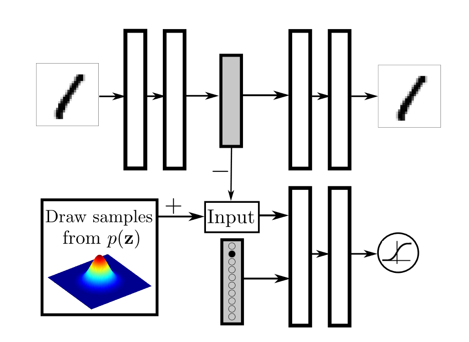

# Adversiarial Autoencoder TF2

A Tensorflow 2.0 implementation of __[Adversarial Autoencoder](https://arxiv.org/abs/1511.05644/)__ (ICLR 2016)

Architecture | Description
------------ | -------------
 | Hidden code regularization, implementation with full label information. Figure 3 from the paper.
 | test
