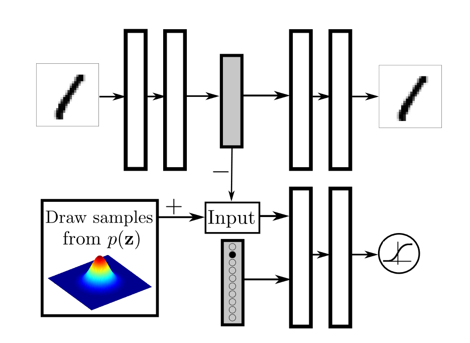
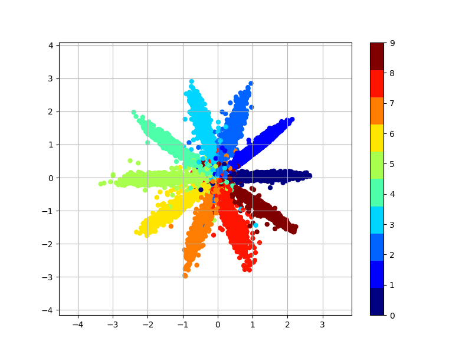
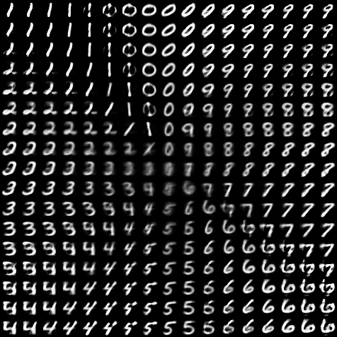
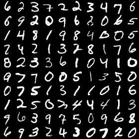
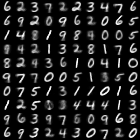
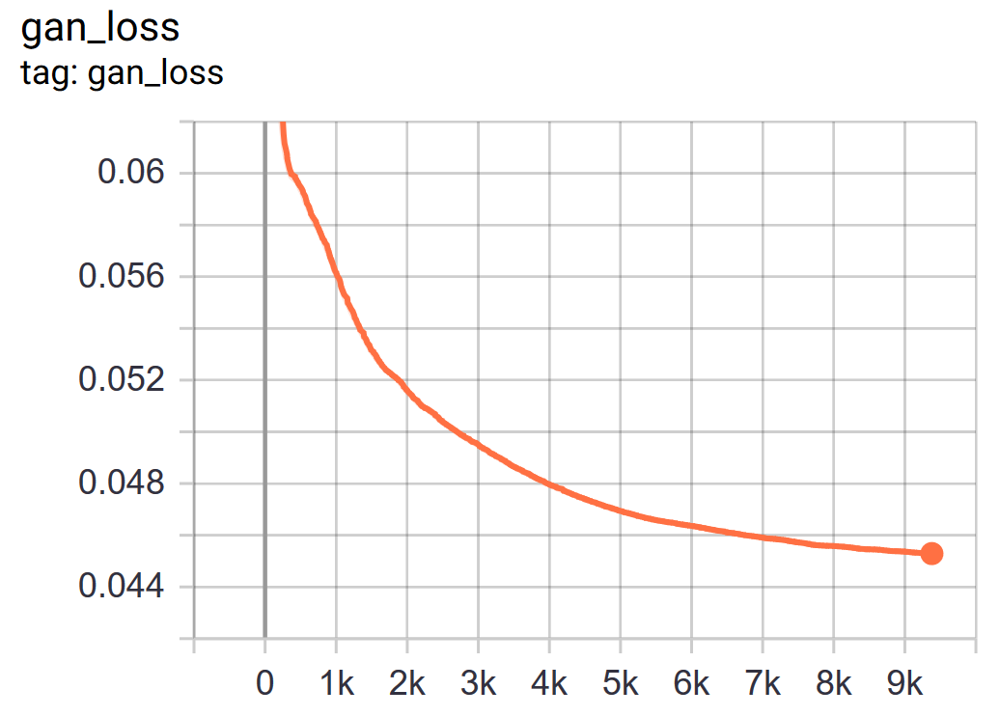
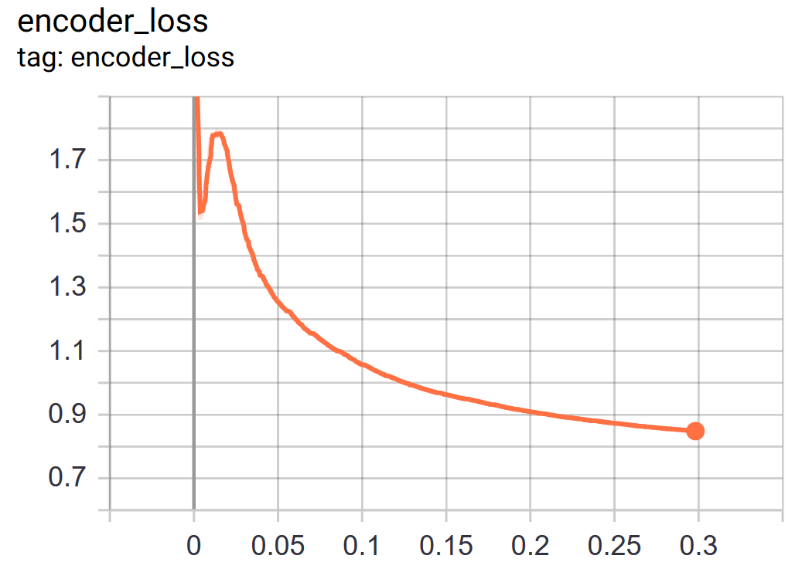
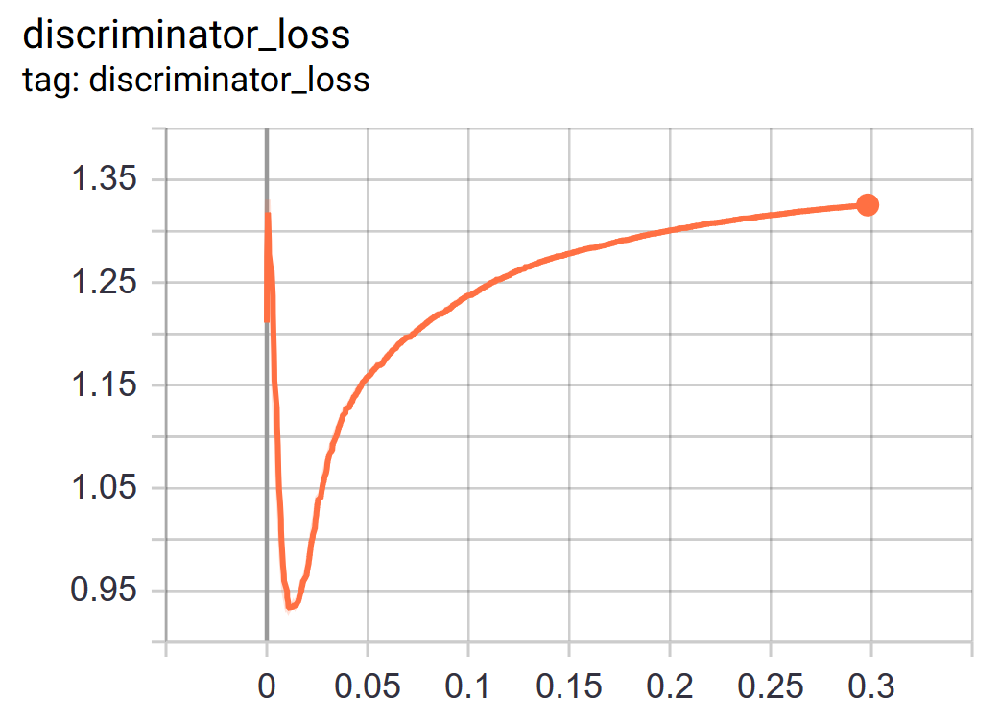

# Adversiarial autoencoder TF2

A Tensorflow 2.0 implementation of __[Adversarial Autoencoder](https://arxiv.org/abs/1511.05644/)__ (ICLR 2016)

## Model
Architecture | Description
------------ | -------------
 | Regularization of the hidden code by incorporationg full label information (Fig.3 from the paper).<br/> <sub>*Alireza Makhzani, Jonathon Shlens, Navdeep Jaitly, and Ian J. Goodfellow. 2015. Adversarial Autoencoders. CoRRabs/1511.05644 (2015). Figure 3 from the paper.*</sub>

## Results
### Latent space
Target prior distribution | Learnt latent space | Sampled decoder ouput
------------ | ------------- |  ------------- 
 || 

### Reconstruction
Input images | Reconstructed images 
------------ | ------------- 
 |


### Training loss
Gan | Encoder | Discriminator
------------ | ------------- |  -------------
 |  |  

## Usage
```
python train_model.py --prior_type gaussian_mixture
```
