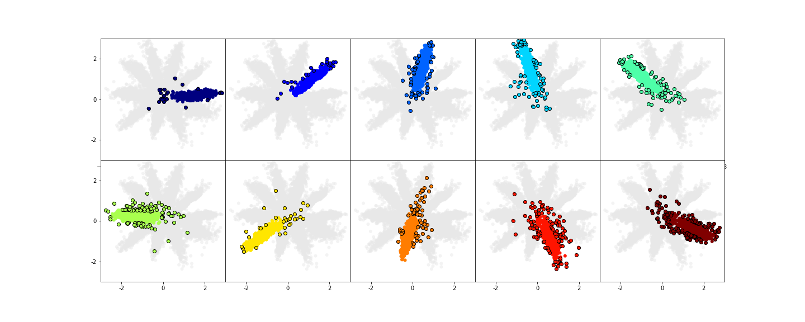

# Notebooks

## Visualization of outliers

### Looking for outliers in the latent space¶

In GAN architecture, encoder learns to map input to the latent space. This notebook shows an example of how to use PCA to detect outliers from the target Gaussian mixture distribution.

|   | 
|:--:| 
| *Outliers from the target Gaussian mixture distribution* |
